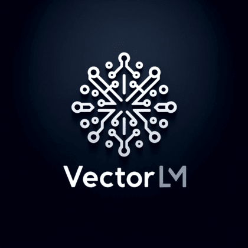

<p align="center">
  
</p>

# VectorLM

AI Engineering Team, Vector Institute.

## Pre-release Notes

Please note that the package is currently in pre-release. There are things that are heavily subject to moving around as we finish polishing the package.

We are actively looking for feedback from end-users! Feature requests and suggestions are welcome.

## Installation

Clone the repository and create a new Python virtual environment. Note that the package is tested with Python >= 3.10.

We need to install the CUDA 11.8 wheel of PyTorch because it now ships with CUDA 12 (Vector GPUs are currently on CUDA 11).

```bash
pip install torch --index-url https://download.pytorch.org/whl/cu118
pip install .
```

It is heavily recommended that you use Flash Attention-2, please follow the instructions [here](https://github.com/Dao-AILab/flash-attention).

## Introduction

VectorLM is a training package built upon HuggingFace models and PyTorch Fully Sharded Data Parallelism. The package has been built around throughput optimizations. It is targeted at largely simplifying the workflow to setup distributed schemes while training **medium-sized** models in **resource-constrained** environments. This is especially true for academic clusters where powerful GPUs are available, but are bottlenecked by interconnectivity. Thus, there are two goals of this light-weight package:
* Use simple sharding strategies. FSDP is a great option for medium-sized model training. It is well maintained by the PyTorch team.
* Employ several optimization techniques to make scaling to larger models possible whilst minimizing memory usage and communication volume. As a result, we are able to efficiently dense finetune LLMs of sizes up to 13B parameters on the Vector cluster.

<details>
<summary><b>What is FSDP?</b></summary>
Also known as ZeRO - Stage 3 sharding, it is a purely data-parallel training scheme built similar to Distributed Data Parallel, except it evenly shards optimizer states and model parameters as well within worker process groups. A good introduction can be found <a href="https://engineering.fb.com/2021/07/15/open-source/fsdp/">here</a>.
</details>

<details>
<summary><b>What is VectorLM not for?</b></summary>
Our package is designed for lightweight operations and is not intended for training very large models. It's primarily focused on facilitating Vector researchers in training moderately-sized models (on the order of 13B parameters) more efficiently. For very large model training setups requiring 3D distributed training strategies, we suggest exploring specialized frameworks like Megatron-LM and DeepSpeed, which are better equipped for such demands.
</details>

## Global Configuration
The central configuration that is used across data preprocessing, training, and dataset loading is under [`configs/config.yaml`](configs/config.yaml). All arguments, as well as recommendations, are documented under [`docs/config.md`](docs/config.md).

## Data Preprocessing

We provide a script for data preprocessing [`preprocess_data.py`](preprocess_data.py). This converts a text dataset into the same format used for model pretaining (causal language modeling). We refrain from providing a script that prepares an instruction finetuning dataset due to different models requiring unique formatting. We also provide options for packing datasets. For more information, please consult the config documentation under [`docs/config.md`](docs/config.md).

## Training

We implement several training optimizations that can be reviewed under [`docs/training_optimizations.md`](docs/training_optimizations.md). All of them are necessary to achieve a high throughput and minimize memory usage and GPU communication as much as possible. It is recommended to familiarize with these.

### Main Classes

* [`Dataset`](vectorlm/dataset.py): It loads the training and test sets as processed by data processing script above. It also sets the dataloaders and shards them across devices.
* [`Trainer`](vectorlm/trainer.py): The main trainer class. It contains the model, optimizer, LR scheduler, and dataloaders. It also performs the training and evaluation steps as well as state checkpointing.

### Example: Llama-2

We have provided an example script to show what a regular workflow would look like for the user. It assumes a preprocessed dataset has already been created. The [`examples/launch.sh`](examples/launch.sh) script begins dense finetuning a Llama-2 7B chat model sharded across a node of 4x A100-80GB GPUs. With the Python environment activated, this can be launched using `sbatch launch.sh`. We also provide a script to launch the same training run in a multinode setting across two A100 nodes at [`examples/launch_multinode.sh`](examples/launch_multinode.sh). Please note that hybrid sharding strategies need to be employed as you scale to multinode settings to minimize communication bottlenecks. More information regarding this can be found in [`docs/config.md`](docs/config.md).

At the end of training, a consolidated model will be saved under your output directory as a `.bin` file. You can simply just run [`vectorlm/utils/convert_to_hf.py`](vectorlm/utils/convert_to_hf.py) to convert it to the regular HuggingFace model format. The script uses the main config file to determine save locations.

### Example: LoRA FSDP

We provide an additional example of parameter-efficient fine-tuning (PEFT) using LoRA and FSDP. Use the [`examples/launch_lora.sh`](examples/launch_lora.sh) to launch your job on the cluster.

# Contributors

Adil Asif, Ziwen Han, John Willes, Jacob-Junqi Tian.
